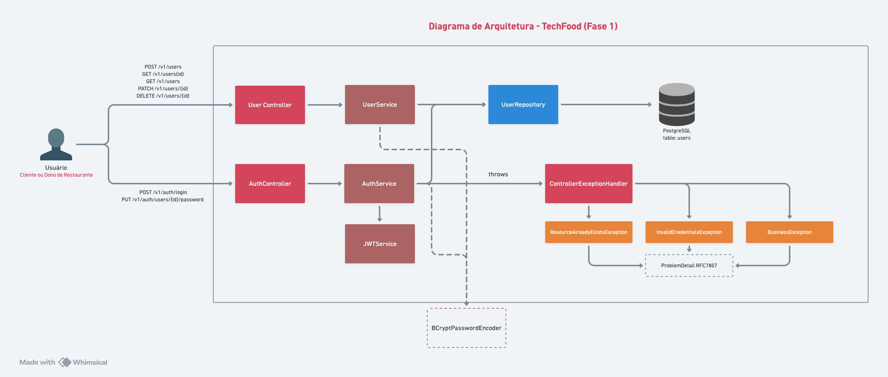
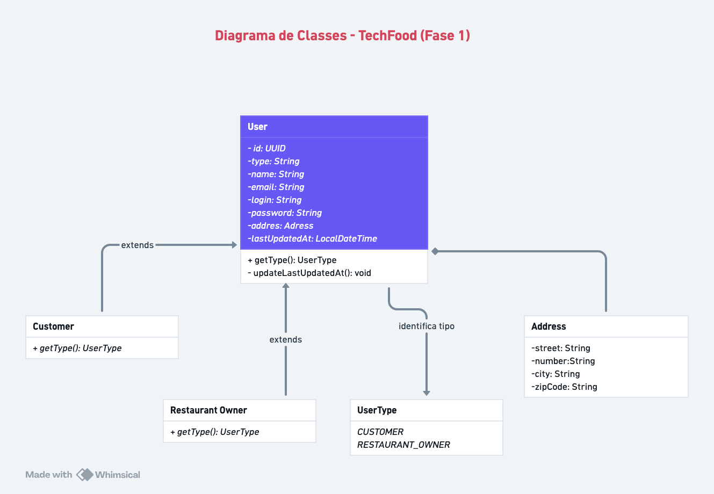

# TechFood

API REST desenvolvida com Java e Spring Boot para gerenciamento de usuários em um sistema de delivery compartilhado entre restaurantes.

---

## Contexto do Projeto

Um grupo de restaurantes decidiu contratar estudantes para construir um sistema de gestão para seus estabelecimentos. Essa decisão
foi motivada pelo alto custo de sistemas individuais, o que levou os
restaurantes a se unirem para desenvolver um sistema único e compartilhado.

Esse sistema permitirá que os clientes escolham restaurantes com base na comida oferecida, em vez de se basearem na qualidade do sistema de gestão.

---

## Tecnologias

- Java 21
- Spring Boot 3.4.2
- Spring Web
- Spring Data JPA
- Spring Security + JWT
- PostgreSQL
- Flyway (versionamento de schema)
- Docker & Docker Compose
- MapStruct
- Lombok
- SpringDoc OpenAPI
- Maven

---

## Arquitetura

A aplicação segue uma arquitetura em camadas:

- controller → entrada HTTP (API REST)
- service → regras de negócio
- repository → acesso ao banco de dados
- model → entidades JPA
- dto → objetos de transferência
- mapper → conversão entre DTO e entidade
- security → autenticação e autorização
- config → configurações
- exceptions → tratamento global de erros

Princípios aplicados:
- SOLID
- Clean Code
- Separação de responsabilidades

### Diagrama de Arquitetura (Fase 1):


---

## Tipos de Usuário

- Dono de restaurante
- Cliente

---

## Funcionalidades

- Cadastro de usuários
- Atualização de dados
- Endpoint exclusivo para troca de senha
- Exclusão de usuários
- Busca de usuários por nome (paginada)
- Validação de login (login + senha)
- Garantia de e-mail único
- Registro da data da última alteração

---

## Banco de Dados

### PostgreSQL

Configuração padrão:
- Host: localhost
- Porta: 5432
- Database: techfood
- Usuário: postgres
- Senha: admin

### Diagrama de Classes (Fase 1)


### Modelo Entidade-Relacionamento (Fase 1)


### Versionamento com Flyway

Migrations SQL em `src/main/resources/db/migration/`:
- `V1__create_table_user.sql` - Criação da tabela de usuários
- `V2__alter_users_add_unique_index.sql` - Adição de índices únicos
- `V3__insert_users.sql` - Inserção de dados iniciais

### H2 Database (Testes)

Durante execução de testes, a aplicação utiliza H2 Database em memória.

---

## Segurança

A aplicação utiliza Spring Security com autenticação baseada em JWT, garantindo:

- Proteção de endpoints
- Autenticação stateless
- Controle de acesso

---

## Endpoints

### Autenticação

| Método | Endpoint | Descrição |
|--------|----------|-----------|
| POST | `/v1/auth/login` | Autentica usuário e retorna JWT |
| PUT | `/v1/auth/users/{id}/password` | Altera senha do usuário |

### Usuários

| Método | Endpoint | Descrição | 
|--------|----------|-----------|
| GET | `/v1/users/{id}` | Busca usuário por ID |
| GET | `/v1/users?name={name}&page={page}&size={size}` | Busca usuários por nome (paginado) |
| POST | `/v1/users` | Cria novo usuário |
| PATCH | `/v1/users/{id}` | Atualiza dados do usuário |
| DELETE | `/v1/users/{id}` | Deleta usuário |

---

## Tratamento de Erros

A API segue o padrão RFC 7807 (Problem Details) para padronização das respostas de erro.

---

## Como executar o projeto

### Pré-requisitos

- Java 21 (JDK Temurin ou OpenJDK)
- Maven 3.8+
- PostgreSQL 15+ (para execução sem Docker) OU Docker

### Opção 1: Com Docker

#### Subir ambiente completo (aplicação + PostgreSQL):

```bash
docker-compose up --build
```

A aplicação estará disponível em: http://localhost:8080

#### Subir apenas o PostgreSQL:

```bash
docker-compose -f docker/docker-compose-postgres.yaml up -d
```

Depois execute:
```bash
mvn clean install
mvn spring-boot:run
```

### Opção 2: Execução local

#### 1. Clonar repositório

```bash
git clone <url-do-repositorio>
cd techfood
```

#### 2. Configurar PostgreSQL local

Certifique-se de que PostgreSQL está rodando em `localhost:5432` com:
- Database: techfood
- Usuário: postgres
- Senha: admin

#### 3. Compilar e rodar

```bash
# Compilar e instalar dependências
mvn clean install

# Executar aplicação
mvn spring-boot:run
```

A aplicação estará disponível em: http://localhost:8080

---

## Documentação da API

Documentação interativa disponível em:

```
http://localhost:8080/swagger-ui/index.html
```

Especificação OpenAPI (JSON):

```
http://localhost:8080/v3/api-docs
```

---

## Testes com Postman

Collection disponível em: `postman/TechFood-postman_collection.json`

Importar no Postman:
1. Abrir Postman
2. File → Import
3. Selecionar arquivo `postman/TechFood-postman_collection.json`

Cenários cobertos:
- Cadastro válido
- Cadastro inválido (e-mail duplicado)
- Alteração de senha
- Atualização de dados
- Busca por nome
- Validação de login

---

## Testes Unitários

### Executar todos os testes

```bash
mvn test
```

### Executar testes de uma classe específica

```bash
mvn test -Dtest=UserControllerTest
```

### Executar testes com cobertura

```bash
mvn test jacoco:report
```

Testes inclusos:
- Testes unitários de controllers (Auth, User)
- Testes de serviço (AuthService, UserService)
- Testes de segurança (JWT, autenticação)
- Testes de validação e tratamento de erros

---

## Build

Compilar e gerar artefato JAR executável:

```bash
mvn clean install
```

Artefato gerado: `target/techfood-0.0.1-SNAPSHOT.jar`

Executar JAR diretamente:

```bash
java -jar target/techfood-0.0.1-SNAPSHOT.jar
```

---

## Grupo

- Lucas Walim
- Pamela Mendes
- Rafael
- Rodrigo Daniel
- Rodrigo de Barros


**Projeto desenvolvido na pós-graduação em Arquitetura e Desenvolvimento Java pela FIAP.**